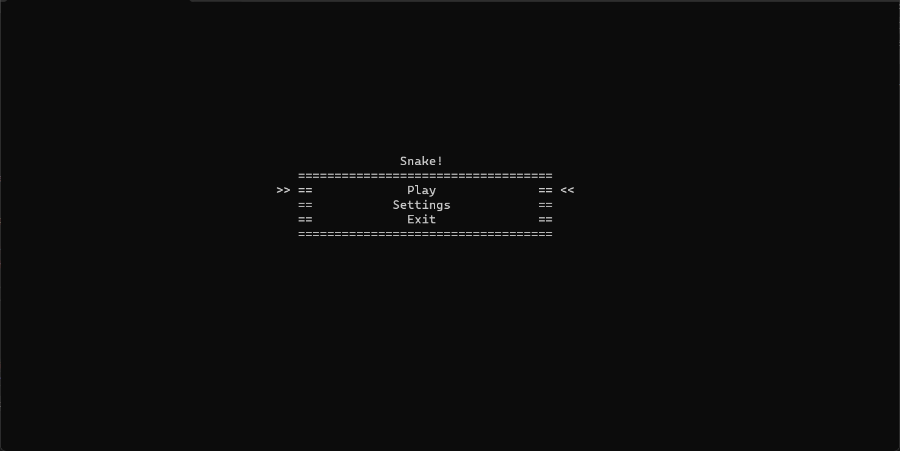
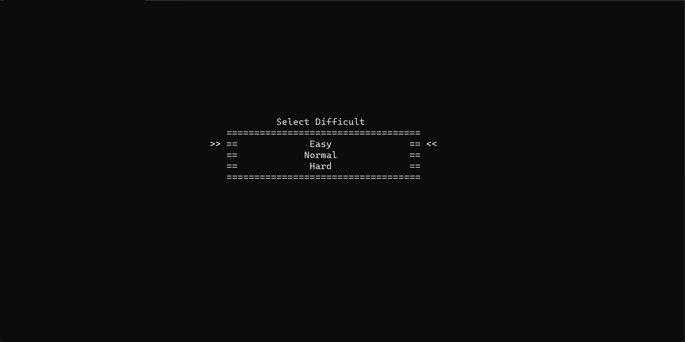
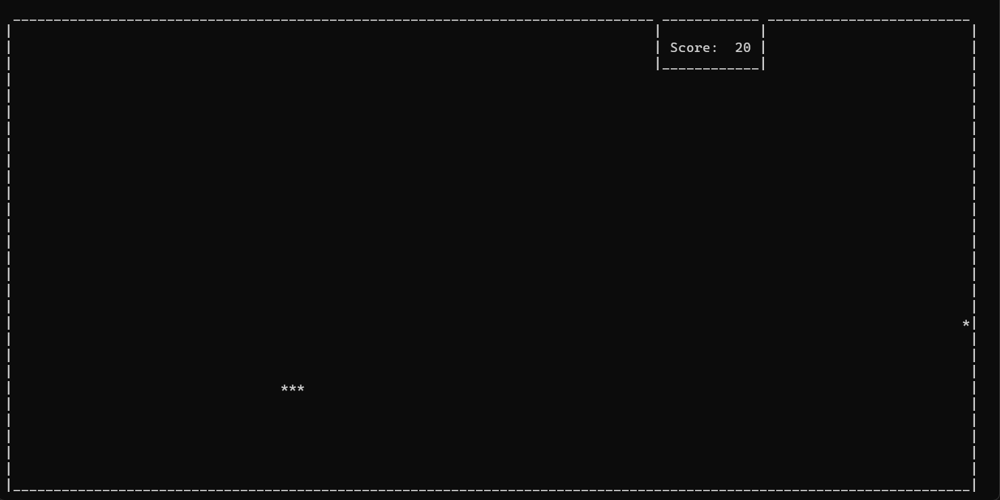

# SnakeGame

Консольна відео-гра в жанрі «Змійка», реалізована з використанням мови програмування C++.

## Опис

SnakeGame - це класична консольна гра, де гравець керує змійкою, яка збирає їжу та збільшується у довжині, уникаючи зіткнень зі стінами та самою собою. Гра також має налаштування рівня складності, яке впливає на швидкість руху змійки. Крім того, гра обчислює кількість зароблених очок залежно від кількості зібраної їжі.

## Встановлення

Для встановлення та запуску проекту використовуйте середовище розробки Visual Studio. Просто клонуйте репозиторій та відкрийте проект у Visual Studio.

## Використання

1. Запустіть проект у Visual Studio.
2. Слідуйте інструкціям у консолі для керування змійкою та грою.

## Функціональність гри

- **Налаштування рівня складності**: Гравець може вибрати рівень складності, що впливає на швидкість руху змійки.
- **Обчислення кількості зароблених очок**: Гра автоматично обчислює кількість зароблених очок залежно від кількості зібраної їжі.

## Приклади роботи гри

## Автор

**Олійник Юрій**

- Пошта: olijnikura@gmail.com
- Телеграм: [@rodtzdream](https://t.me/rodtzdream)

## Ліцензія

Цей проект розповсюджується без явної ліцензії. Він є вільним програмним забезпеченням, і ви можете використовувати, модифікувати та розповсюджувати його за вашим бажанням.
